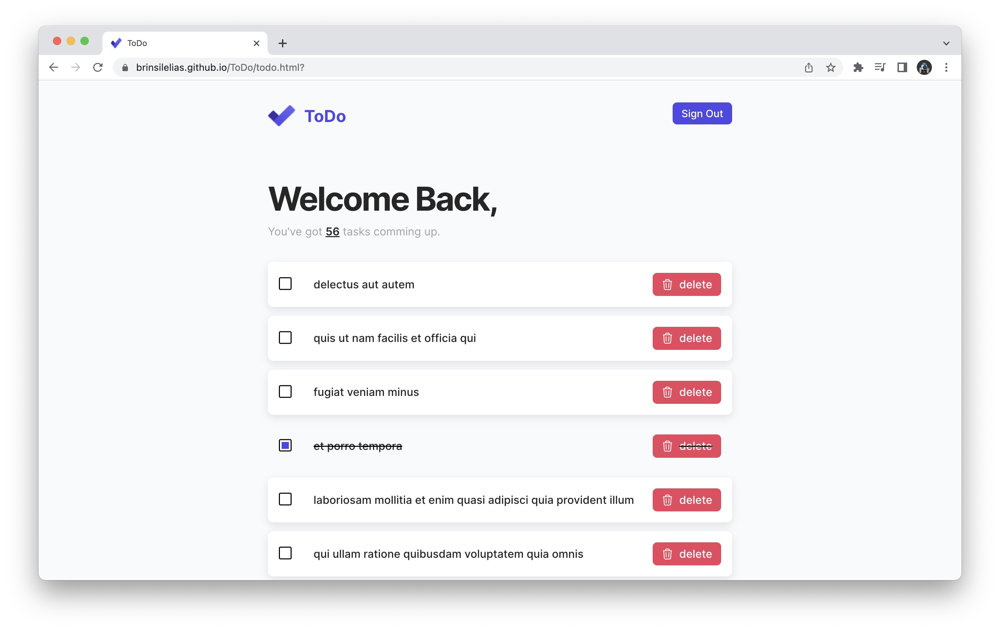

# ToDo

  <a href="#">About The Project</a>&nbsp;&nbsp;&nbsp;|&nbsp;&nbsp;&nbsp;
  <a href="#">Technologies</a>&nbsp;&nbsp;&nbsp;|&nbsp;&nbsp;&nbsp;
  <a href="#">Running the Project</a>

---

## 🚀 About the Project

Todo is an application built using HTML, CSS, and JavaScript. The application fetches a todo list from an API and displays it to the user. The user complete the task by checking the todo or delete todos from the list.The application is responsive, so it can be used on different devices. It is also easy to use and navigate.

---
## 💻 Technologies
- [HTML5](https://developer.mozilla.org/en-US/docs/Glossary/HTML5)
- [CSS3](https://developer.mozilla.org/en-US/docs/Web/CSS)
- [JavaScript](https://developer.mozilla.org/en-US/docs/Web/JavaScript)
- [VS Code](https://code.visualstudio.com) and [Prettier RC](https://github.com/prettier/prettier)

---

##  Running the project
Visit this link: [ToDo.com](https://brinsilelias.github.io/ToDo/) and enter the username and password in the login screen.
- username : admin
- password : 12345

---

